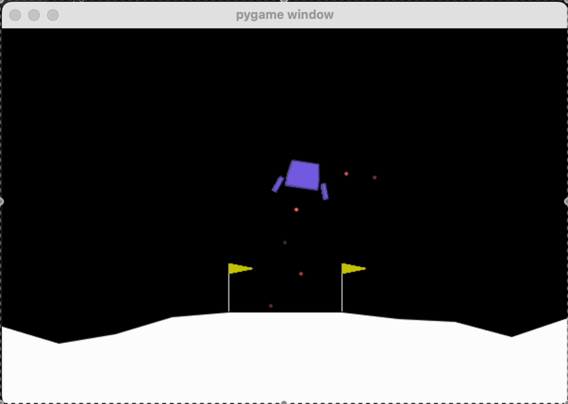

# lunar-lander-reinforcement-learning

Project to train rl model with pytorch for Lunar lander game

Demo:


Installation:
You may need to download these libraries to get started:

```python
pip install torch numpy gym gymnasium
```

then just run:

```python
python train.py
```
